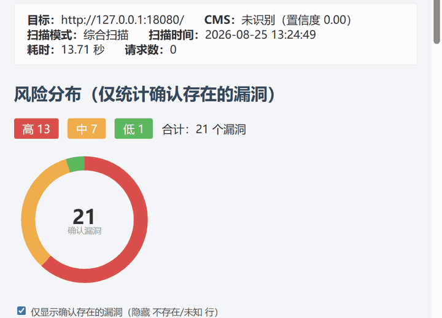

# Ruoyi-Scan — 若依专项漏洞扫描工具

[](https://github.com/xiabai2008/Ruoyi-Scan/actions/workflows/ci.yml)
[](https://www.python.org/downloads/)
[](LICENSE)
[](https://codecov.io/gh/xiabai2008/Ruoyi-Scan)

[中文](README.md) | [English](README_EN.md)

> 一款合法授权的**若依（RuoYi）专项漏洞扫描器**，插件化架构，三态判定（CONFIRMED / SAFE / UNKNOWN）。
> 支持批量扫描、多格式报告、WAF 绕过、漏洞利用链、Web API 等企业级特性。

---

## 演示

<p align="center">
  
</p>

> 上图：对内置若依签名靶场执行综合扫描，实时展示风险分布与漏洞列表。

---

## 文档

| 文档 | 说明 |
|------|------|
| [用户指南](docs/USAGE.md) | 安装配置、扫描模式、CLI 参数详解 |
| [插件开发教程](docs/PLUGIN_DEV.md) | PluginBase、三态判定、entry_points 注册 |
| [API 文档](docs/API.md) | REST 端点、WebSocket 事件、OpenAPI 规范 |
| [贡献指南](CONTRIBUTING.md) | 开发流程、代码规范、提交约定 |
| [变更日志](CHANGELOG.md) | 版本历史与变更记录 |

---

## 项目定位

- **作者**：XIABAI
- **版本**：1.1.0
- **仓库**：https://github.com/xiabai2008/Ruoyi-Scan
- **技术栈**：Python 3.8+ / requests / FastAPI / Docker
- **许可**：MIT License

---

## 核心能力

| 模块 | 说明 |
|------|------|
| `plugins/ruoyi/` | 若依 16 个 POC（文件读取、SQL 注入、RCE、SSTI、未授权等）+ 5 变体识别（Vue3/App/Plus/Cloud-Plus） |
| `plugins/spring/` | Spring Boot 14 个 POC（Actuator、Gateway、Jolokia、Spring4Shell 等） |
| `plugins/common/` | 通用漏洞包（.git/.env 泄露、备份文件、CORS、Swagger 等） |
| 指纹识别 | favicon hash + 特征路径 + 关键字，多 CMS 数据驱动 + 若依变体细分 |
| 组件版本检测 | fastjson/SpringBoot/Shiro/Nacos/Log4j 版本比对 CVE 映射（`--components`） |
| 三态判定 | CONFIRMED（确认存在）/ SAFE（确认不存在）/ UNKNOWN（无法判定） |
| WAF 绕过 | 11 种绕过策略 + 三态判定保护矩阵 + 成功率追踪 |
| 漏洞利用链 | DAG 拓扑编排 + 条件分支 + 3 条内置链 |
| nuclei 模板兼容 | 直接执行 nuclei-templates YAML 模板（`--nuclei`，http 协议子集 + 安全白名单） |
| 插件模板仓库 | 导出/manifest/Ed25519 强制验签/`--plugin-update` 社区分发闭环 |
| AI POC 生成 | `--ai` 自然语言生成插件（LLM 自验证回灌，无 Key 降级规则模板） |
| AI 报告解读 | `--ai-report zh\|en` 自动生成漏洞分析与修复优先级 |
| 批量扫描 | `-f targets.txt` 多目标 + 批量汇总报告 |
| 报告输出 | HTML（SVG 图表）/ JSON / CSV / PDF / Word / Excel / SARIF + 版本对照表 |
| Web API | FastAPI REST + WebSocket 实时推送 + Web 控制台 + 权限分级（read/scan/admin）+ 定时扫描 |
| 并发限速 | ThreadPoolExecutor + 令牌桶（锁外 sleep，无并发退化） |
| 验证码处理 | 自动探测 / OCR 识别 / 跳过 三模式 |
| 多版本适配 | RuoYi 4.2 / 4.7 / v5 / v3.9.x 版本感知 POC 过滤 |
| 端口扫描 | TCP 端口扫描 + 服务识别 + Banner 抓取 |
| 被动代理 | HTTP/HTTPS 代理，捕获流量自动扫描 |
| OAST 带外检测 | 自建回调服务器 + 6 种 payload 模板（SSRF/XXE/SQL盲注/RCE盲注/LDAP/命令注入） |
| 业务逻辑检测 | IDOR / 越权 / 参数篡改 / 竞争条件 4 类检测器 |
| CVE 同步 | NVD REST API + 24h TTL 缓存 + CWE→OWASP/等保 合规映射 |
| SIEM 集成 | ECS / CEF / LEEF / JSON 4 格式导出 + Syslog 转发 |
| 异步引擎 | ThreadPoolExecutor 并发扫描 + aiohttp 可选异步 HTTP |
| 分布式扫描 | Redis Master-Worker 队列 + Standalone 降级模式 |
| 结果缓存 | SQLite 持久化 + SHA256 键 + TTL + 命中率统计 |
| 扫描模板 | quick / deep / compliance / dengbao 4 种预设策略 |
| 认证扫描 | Cookie / Token / Bearer / 自动登录 4 种认证注入 |
| 国际化 | 中英文报告切换（`--lang zh|en`） |
| 插件 SDK | 模板生成 + 验证 + 枚举（`--plugin-init` / `--plugin-check`） |
| CI/CD 集成 | 严重度阈值退出 + GitHub Code Scanning（SARIF）+ GitLab/Jenkins 模板 |
| 漏洞知识库 | 离线 HTML Wiki + JSON API |

---

## 快速开始

### 方式一：从 Release 下载安装（推荐）

前往 [Releases 页面](https://github.com/xiabai2008/Ruoyi-Scan/releases) 下载最新 `.whl` 文件，然后：

```bash
# 安装（自动安装核心依赖）
pip install ruoyi_scan-1.1.0-py3-none-any.whl

# 可选功能依赖（按需安装）
pip install pyyaml          # --config YAML 配置文件
pip install redis           # --distributed Redis 分布式扫描
pip install aiohttp         # --async 异步 HTTP 客户端

# 运行扫描
ruoyi-scan -p http://target:8080/
```

### 方式二：源码安装

```bash
git clone https://github.com/xiabai2008/Ruoyi-Scan.git
cd Ruoyi-Scan
pip install -r requirements.txt

# 单目标漏洞扫描
python main.py -p http://target:8080/

# 批量扫描
python main.py -f targets.txt -p --report ./reports

# 手动指定 CMS（跳过指纹识别）
python main.py -p http://target:8080/ --cms ruoyi

# 综合扫描（目录扫描 + 漏洞检测 + 登录爆破）
python main.py -u http://target:8080/

# 生成全格式报告（HTML/JSON/CSV/PDF/Word/Excel）
python main.py -p http://target:8080/ --report ./reports --report-format all

# WAF 绕过（检测到 WAF 自动启用）
python main.py -p http://target:8080/ --bypass-waf auto

# 执行漏洞利用链
python main.py --chain ruoyi_sql_to_rce -u http://target:8080/
python main.py --chain list  # 列出可用链

# 组件版本检测（fastjson/SpringBoot/Shiro/Nacos/Log4j → CVE 比对）
python main.py -p http://target:8080/ --components

# 执行 nuclei 模板（nuclei-templates 生态直接复用）
python main.py -p http://target:8080/ --nuclei examples/nuclei/
python main.py --nuclei-validate examples/nuclei/  # 模板校验（不扫描）

# AI 生成插件（LLM 自验证回灌；无 Key 时降级规则模板）
python main.py --ai "检测若依任意文件读取漏洞" --category ruoyi

# 插件模板仓库（社区分发）
python main.py --plugin-export ./ruoyi-scan-templates
python main.py --plugin-manifest ./ruoyi-scan-templates  # 生成/校验 manifest（Ed25519 签名）
python main.py --plugin-update  # 从官方仓库更新插件

# Web API 服务
python main.py --serve
# 访问 http://localhost:8000/ (Web 控制台)
# 访问 http://localhost:8000/docs (OpenAPI 文档)

# 端口扫描 + 漏洞检测
python main.py -p http://target:8080/ --portscan

# 被动代理模式
python main.py --passive --passive-port 8080

# Docker 部署（见下方「Docker 部署」章节）
# docker-compose up -d
```

### Docker 部署

Ruoyi-Scan 提供生产就绪的 Docker 镜像（多阶段构建、非 root 用户）。

**构建镜像**

```bash
docker build -t ruoyi-scan .
```

**扫描目标**

```bash
# 基本扫描
docker run --rm ruoyi-scan -p http://target/

# 扫描并保存报告到宿主机
docker run --rm -v $(pwd)/reports:/app/reports ruoyi-scan \
  -p http://target/ --report /app/reports
```

**Web API 服务**

```bash
# 启动 FastAPI Web API（端口 8000）
docker run --rm -p 8000:8000 ruoyi-scan --serve --host 0.0.0.0 --port 8000

# 带认证的 API
docker run --rm -p 8000:8000 -e RUOYI_SCAN_API_KEY=your-secret ruoyi-scan \
  --serve --host 0.0.0.0 --port 8000 --api-key your-secret
```

**Docker Compose 一键部署**

```bash
# 启动全部服务（扫描器 + API + 2 个签名靶场）
docker compose up -d

# 扫描内置靶场
docker compose run --rm scanner -p http://lab-ruoyi:8080/ --report /app/reports

# 启动监控栈（Prometheus + Grafana）
docker compose --profile monitor up -d
# Grafana: http://localhost:3000 (admin/admin)
# Prometheus: http://localhost:9090

# 清理
docker compose down
```

| 服务 | 端口 | 说明 |
|------|------|------|
| scanner | - | 扫描器 CLI（通过 `docker compose run` 调用） |
| api | 8000 | FastAPI Web API + WebSocket + Web 控制台 |
| lab-ruoyi | 8080 | 若依签名靶场（vuln 模式） |
| lab-spring | 8091 | Spring Boot 签名靶场（vuln 模式） |
| prometheus | 9090 | 指标采集（`--profile monitor`） |
| grafana | 3000 | 监控面板（`--profile monitor`） |

### CLI 参数速查

> 完整参数说明请运行 `python main.py -h`。以下按功能分组列出全部参数。

#### 核心扫描模式

| 参数 | 说明 |
|------|------|
| `-h` | 帮助信息 |
| `-u <url>` | 综合扫描（目录+漏洞+爆破） |
| `-m <url>` | 目录扫描 |
| `-p <url>` | 漏洞检测 |
| `-l <url>` | 登录爆破 |
| `-f <file>` | 批量扫描（从文件读取目标列表） |
| `--cms <ruoyi\|spring>` | 手动指定 CMS（跳过指纹识别） |
| `--pass-level <lvl>` | 口令字典级别 top100/top1000/full |
| `--template <name>` | 扫描模板（quick/deep/compliance/dengbao） |
| `--template-list` | 列出所有可用模板 |
| `--config <path>` | YAML 配置文件（CLI 参数优先级高于配置） |

#### 网络与并发

| 参数 | 说明 |
|------|------|
| `--proxy <url>` | 代理地址（如 http://127.0.0.1:8080） |
| `--proxy-file <f>` | 代理池文件（每行一个代理 URL） |
| `--proxy-rotate <s>` | 代理轮换策略 round-robin/random/least-fail |
| `--threads <n>` | 并发线程数 |
| `--rate <n>` | 每秒请求数（0=不限速） |
| `--timeout <n>` | 请求超时秒数 |
| `--debug` | 调试模式（请求日志输出到 stderr） |

#### 信息收集（D14）

| 参数 | 说明 |
|------|------|
| `--crawl` | 启用主动爬虫 |
| `--crawl-depth <n>` | 爬虫最大深度（默认 2） |
| `--crawl-max-pages <n>` | 爬虫最大页面数（默认 50） |
| `--subdomain` | 启用子域名枚举 |
| `--js-extract` | 启用 JS 端点提取 |
| `--portscan` | 端口扫描 + 服务识别 |
| `--ports <p1,p2>` | 自定义端口列表（逗号分隔） |
| `--passive` | 启动被动代理模式 |
| `--passive-host <addr>` | 代理监听地址（默认 127.0.0.1） |
| `--passive-port <n>` | 代理监听端口（默认 8080） |

#### 报告与输出

| 参数 | 说明 |
|------|------|
| `--report <dir>` | 报告输出目录 |
| `--report-format <f>` | 报告格式 html/json/csv/pdf/docx/xlsx/sarif |
| `--no-dedup` | 关闭结果去重聚合 |
| `--lang <zh\|en>` | 报告语言（默认 zh） |
| `--diff <old.json>` | 与历史扫描报告对比 |
| `--diff-only <old> <new>` | 仅对比两个 JSON 报告 |
| `--save-baseline` | 保存本次扫描结果为基线 |

#### WAF 绕过与利用链

| 参数 | 说明 |
|------|------|
| `--bypass-waf <auto\|on\|off>` | WAF 绕过策略（默认 auto） |
| `--chain <name>` | 执行漏洞利用链 |
| `--chain-list` | 列出所有可用的漏洞利用链 |

#### 认证扫描（D26）

| 参数 | 说明 |
|------|------|
| `--auth <type=value>` | 认证注入（可多次指定） |
| `--auth-file <path>` | 从文件加载认证信息 |
| `--auth-login <user:pass>` | 自动登录获取认证 |

#### Web API 服务（D9/D11）

| 参数 | 说明 |
|------|------|
| `--serve` | 启动 Web API 服务（FastAPI + WebSocket + Web 控制台） |
| `--host <addr>` | API 服务监听地址（默认 0.0.0.0） |
| `--port <n>` | API 服务监听端口（默认 8000） |
| `--api-key <key>` | API Key 鉴权 |
| `--cors-origins <o>` | 允许的 CORS 源（逗号分隔） |
| `--db-path <path>` | SQLite 任务持久化数据库路径 |

> 详细的 API 端点说明、请求/响应示例、WebSocket 事件格式请参考 [API 使用指南](docs/API.md)。
> OpenAPI 3.0 规范可通过 `python scripts/export_openapi.py` 导出至 `docs/openapi.json`。

#### OAST 带外检测（D30）

| 参数 | 说明 |
|------|------|
| `--oast` | 启用 OAST 带外检测 |
| `--oast-server` | 启动 OAST 回调服务器 |
| `--oast-host <addr>` | OAST 服务器监听地址 |
| `--oast-port <n>` | OAST 服务器监听端口 |

#### 业务逻辑检测（D31）

| 参数 | 说明 |
|------|------|
| `--logic-scan` | 业务逻辑漏洞检测（IDOR/越权/参数篡改/竞争条件） |
| `--logic-endpoints <file>` | 业务扫描端点列表文件 |
| `--logic-concurrency <n>` | 竞争条件检测并发数 |

#### CVE 同步（D32）

| 参数 | 说明 |
|------|------|
| `--cve-sync` | 同步 NVD CVE 信息 |
| `--cve-id <CVE-ID>` | 查询单个 CVE 信息 |
| `--nvd-api-key <key>` | NVD API Key（提高速率限制） |

#### SIEM 集成（D33）

| 参数 | 说明 |
|------|------|
| `--siem-export <fmt>` | 导出 SIEM 格式（ecs/cef/leef/json） |
| `--siem-output <path>` | SIEM 导出路径 |
| `--siem-syslog <host:port>` | 发送到 Syslog 服务器 |
| `--siem-protocol <p>` | Syslog 协议 udp/tcp |

#### 异步引擎（D34）

| 参数 | 说明 |
|------|------|
| `--async` | 启用异步扫描引擎（ThreadPoolExecutor） |
| `--async-workers <n>` | 异步并发线程数（默认 10） |

#### Web UI 控制台（D35）

| 参数 | 说明 |
|------|------|
| `--web-ui` | 生成 Web UI 控制台（单页 HTML） |
| `--web-ui-output <path>` | Web UI 输出路径 |
| `--web-ui-api <url>` | Web UI 连接的 API 地址 |

#### 分布式扫描（D36）

| 参数 | 说明 |
|------|------|
| `--distributed <mode>` | 分布式模式（master/worker/standalone） |
| `--redis-url <url>` | Redis 连接 URL |
| `--distributed-rate <n>` | 分布式全局限速（每秒请求数，0 不限速） |
| `--worker-max-tasks <n>` | Worker 最大任务数（0 不限） |
| `--distributed-timeout <n>` | 分布式超时秒数（默认 600） |

#### 结果缓存（D37）

| 参数 | 说明 |
|------|------|
| `--cache` | 启用扫描结果缓存（SQLite） |
| `--cache-ttl <n>` | 缓存有效期秒数（默认 3600） |
| `--cache-db <path>` | 缓存数据库路径 |
| `--cache-stats` | 查看缓存统计 |
| `--cache-clear` | 清除过期缓存 |
| `--cache-clear-all` | 清除全部缓存 |

#### 通知（D21）

| 参数 | 说明 |
|------|------|
| `--notify <type=target>` | 扫描完成通知（可多次指定） |

#### 插件 SDK（D25）

| 参数 | 说明 |
|------|------|
| `--plugin-init <name>` | 生成插件模板 |
| `--plugin-check <path>` | 验证插件文件完整性 |
| `--plugin-list` | 列出所有已加载插件 |
| `--category <cat>` | 插件类别 ruoyi/spring/common |

#### CI/CD 集成（D28）

| 参数 | 说明 |
|------|------|
| `--ci` | CI 模式（严重度超阈值时退出码非 0） |
| `--severity-threshold <lvl>` | CI 失败阈值 low/medium/high（默认 high） |
| `--ci-init <platform>` | 生成 CI 配置（github/gitlab/jenkins） |

#### 漏洞知识库（D29）

| 参数 | 说明 |
|------|------|
| `--wiki` | 生成漏洞知识库（HTML Wiki + JSON API） |
| `--wiki-output <path>` | 知识库输出路径 |

---

## 扫描模式速览

核心命令只有两个：`-p`（单目标漏洞扫描）和 `-u`（综合扫描）。两者区别：

| 对比项 | `-p` 单目标漏洞扫描 | `-u` 综合扫描 |
|--------|----------------------|----------------|
| 执行内容 | 仅执行 `vuln` 类插件（RCE、文件读取、越权、信息泄露等漏洞判定） | 全流程依次执行：`recon` 信息收集（目录扫描、目录列表探测）→ `vuln` 漏洞检测 → `brute` 弱口令爆破（Druid、默认口令等） |
| 特点 | 速度快、请求量小，单点漏洞确认 | 完整风险评估，耗时较长 |
| 适合场景 | 已知目标，只想快速确认是否存在漏洞 | 需要对目标做一次全面评估 |

```bash
# 仅快速确认漏洞（单目标）
python main.py -p http://target:8080/

# 完整评估（目录 + 漏洞 + 爆破）
python main.py -u http://target:8080/
```

> 仍不清楚该选哪种？可参考 [issue #1 的讨论](https://github.com/xiabai2008/ruoyi-scan/issues/1)（两种模式的区别详解）。

---

## 目录结构

```
Ruoyi-Scan/
├── main.py                  # CLI 入口（~390 行，纯参数解析+分发）
├── config/settings.py       # 全局配置
├── core/                    # 核心引擎层
│   ├── runner.py            # 扫描编排器（P0 拆分）
│   ├── engine.py            # 并发编排+令牌桶限速
│   ├── models.py            # 数据模型（三态判定）
│   ├── loader.py            # 插件动态发现
│   ├── fingerprint.py       # 指纹识别
│   ├── router.py            # 指纹→插件路由
│   ├── session.py           # 会话封装
│   ├── chain.py             # 漏洞利用链引擎
│   ├── report.py            # 报告渲染（HTML/JSON/CSV）
│   └── ...                  # 更多核心模块
├── plugins/                 # 插件系统
│   ├── base.py              # PluginBase 抽象基类
│   ├── ruoyi/               # 若依 16 个 POC
│   ├── spring/              # Spring 14 个 POC
│   ├── common/              # 通用 8 个 POC
│   └── chain/               # 3 条利用链
├── lib/                     # 工具库（31 个模块）
├── api/                     # Web API（FastAPI + WebSocket）
├── data/                    # 字典文件
├── tests/                   # 38 个测试文件 / 887 条用例
├── lab/                     # 靶场环境
├── web/                     # Web 控制台前端
├── monitoring/              # Grafana + Prometheus
├── .github/workflows/       # CI 配置
├── Dockerfile               # Docker 镜像
├── docker-compose.yml       # Docker 编排
├── LICENSE                  # MIT License
└── requirements.txt         # 依赖管理
```

---

## 测试

```bash
# 全量测试
python -m pytest tests/ -q

# 若依插件回归
python tests/regression_ruoyi.py

# Spring 插件回归
python tests/regression_spring.py
```

---

## 贡献

欢迎贡献 POC 与改进：

- **报告 Bug / 请求 POC**：使用 [Issue 模板](https://github.com/xiabai2008/Ruoyi-Scan/issues/new/choose)（Bug / POC 请求 / 功能请求）
- **提交 POC**：`python main.py --plugin-init <name>` 生成骨架 → 实现 `verify()`（三态判定）→ `--plugin-check` 验证 → PR（模板含完整 checklist）
- **插件分发**：合入后自动进入 [ruoyi-scan-templates](https://github.com/xiabai2008/ruoyi-scan-templates) 官方仓库（Ed25519 签名）
- **开发指南**：[docs/PLUGIN_DEV.md](docs/PLUGIN_DEV.md) / [CONTRIBUTING.md](CONTRIBUTING.md)

> 贡献 POC 前请先在自建靶场（`lab/`）或授权目标上复现，确保判定特征真实可靠。

---

## 安全与合规

本工具仅用于**授权范围内**的安全测试与学习研究。不得用于未授权目标。涉及利用的插件默认仅做存在性验证，不做实际破坏。

---

## License

MIT License © 2026 XIABAI
